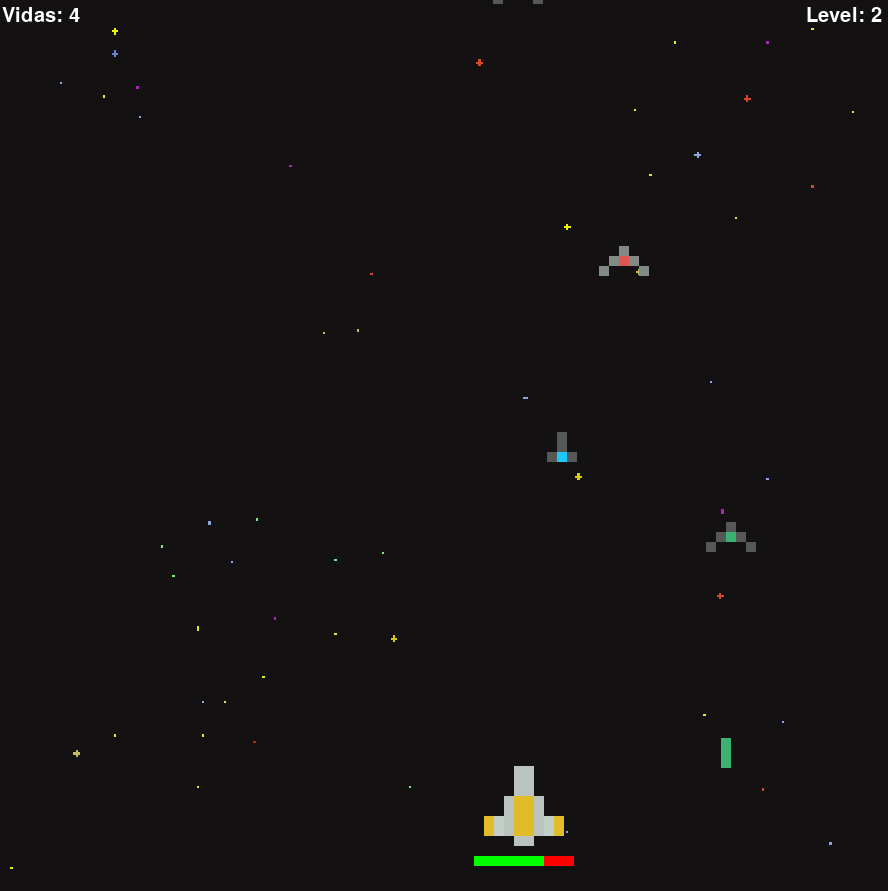
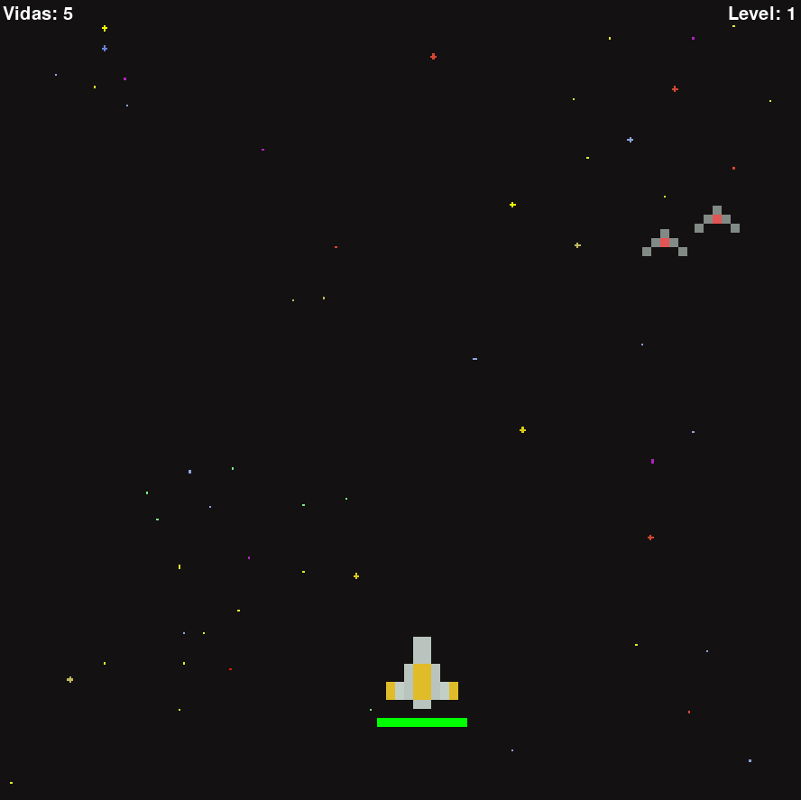

# Alien Shooter Game
Um jogo no estilo arcade que tem o objetivo de treinar o uso de OOP (Programação Orientada a Objetos) usando a linguagem Python.

---

*Imagens de exemplo:*  
<div style="display:flex; flex-direction: column; align-items:center">
  
  
</div>

---
## Como rodar o jogo

- Instale o [python](https://www.python.org/downloads/)
- Instale o PyGame, no terminal digite:

```
pip install pygame
```

- Com o [git](https://git-scm.com/downloads) instalado, clone esse repositório:
```
git clone https://github.com/phellipeduarte/alien_shooter_game
```
- No terminal, no endereço da pasta do repositório baixado, digite:
```
python main.py
```
